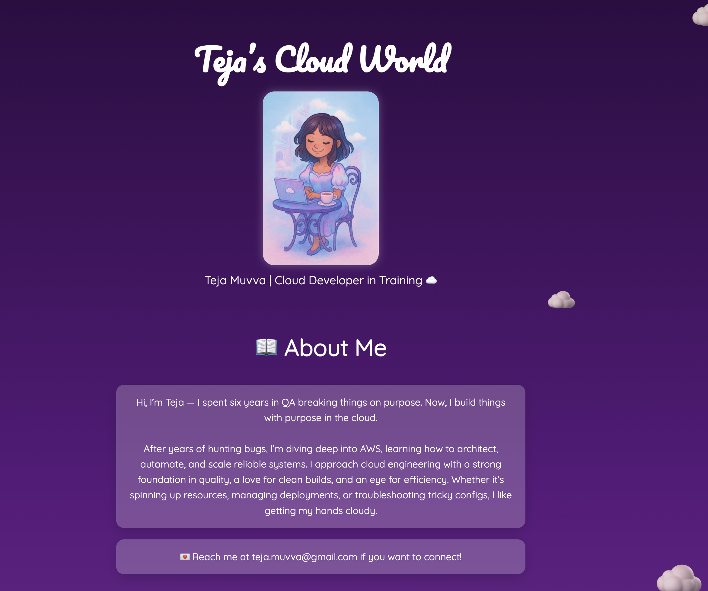
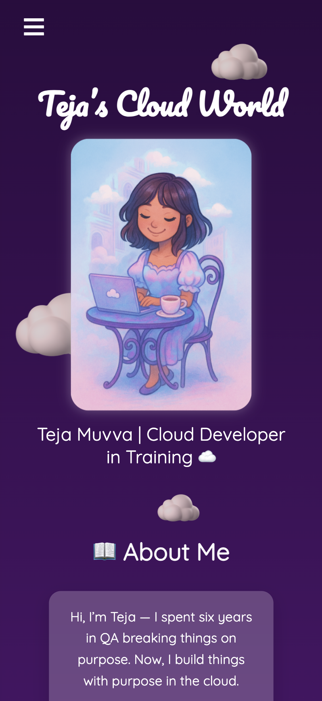

# ☁️ Teja's Cloud Portfolio

A fully static, mobile-friendly portfolio website hosted on **AWS S3**, fronted by **CloudFront**, and deployed automatically via **GitHub Actions** using OIDC (no AWS secrets required!).

---

## 🚀 Features

- 🎨 Responsive, accessible, and aesthetic HTML/CSS/JS design
- ☁️ Hosted on Amazon S3 with HTTPS enabled via CloudFront
- 🔄 Auto-deploys on every `main` branch push using GitHub Actions
- 🔐 Secure authentication via GitHub OIDC (no stored credentials)
- 🔁 CloudFront cache invalidation with every deploy

---

## 🛠 Stack

- **Frontend:** HTML, CSS, JavaScript
- **CI/CD:** GitHub Actions
- **Cloud Services:** AWS S3, CloudFront, IAM, CloudFormation

---

## 📦 Project Structure

```
.
├── index.html             # Main webpage
├── style.css              # Stylesheet
├── script.js              # JavaScript for interactivity
├── images/                # Folder for all visual assets
├── README_images/         # Auto-generated preview assets 
├── README.md              # Project documentation
└── .github/
    └── workflows/
        └── deploy.yml     # GitHub Actions workflow for S3 CloudFront deployment
```

---

## 💡 How It Works

1. Push code to `main`
2. GitHub Actions:
   - Assumes an IAM role via OIDC
   - Syncs the site to your S3 bucket
   - Invalidates CloudFront cache
3. Changes go live automatically!

---

## 🌐 Live Site

> 🔗 [tejain.space](#)  

---

## 🧠 Want to Build Something Similar?

Check out the [CloudFormation Template for GitHub Actions OIDC Deploy](.github/cloudformation/github-oidc-deploy.yaml) and [GitHub Actions workflow](.github/workflows/deploy.yml) to learn how this serverless CI/CD pipeline works.

---

## 📸 Screenshots

### 🌤️ Homepage



### 💡 Mobile View



---

## ✨ Author

Made with ☁️ and ☕ by [@tejmoo](https://github.com/tejmoo)